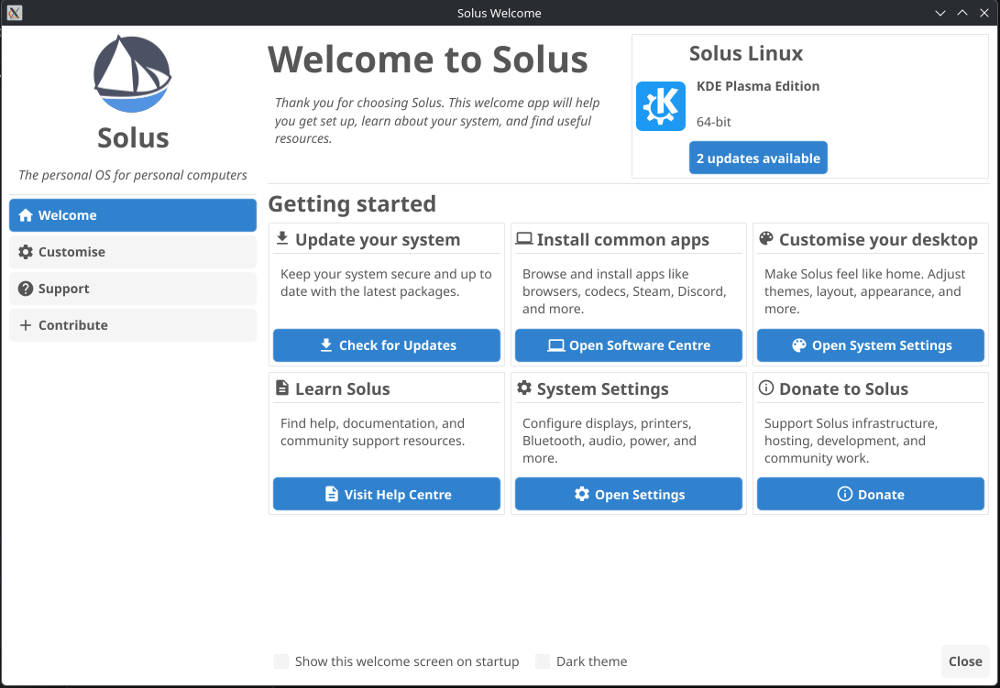

# Solus Welcome App

A lightweight Go-based welcome application for SolusOS.

This application provides users with a SolusOS welcome app and is built using the [Fyne](https://fyne.io/) GUI toolkit for Go, it is both fast and cross-platform compatible.

<p align="center">
  
</p>

## Features

- **Smart Environment Detection**: Automatically creates shortcuts and settings based on your active desktop (Budgie, GNOME, KDE, XFCE).
- **System Updates**: Checks for available packages and lets you upgrade your system with a single click.
- **Quick Launcher**: Easy access to open your software center, system settings, or Solus documentation.
- **User Preferences**: Includes a built-in dark mode toggle and options to manage autostart behavior on boot.

## Installation

Pre-compiled binaries can be found in the `bin/` directory of this repository for testing purposes.

You can easily install the application using the provided install script:

```bash
./install.sh
```

Running the script, you will be presented with a menu:
1. **Install from pre-compiled binary**: Installs the existing binary directly without needing the Go toolchain.
2. **Compile from source and install**: Automatically builds a stripped, optimized Go binary and installs it.

Both methods will install the app and its associated assets (desktop entries, SVGs) into your system directories (`/usr/bin` and `/usr/share`).

## Development & Build Dependencies

If you are modifying or compiling this application from source on SolusOS, you will need the Go toolchain and a few C-level X11/Wayland development headers required by Fyne.

You can easily install all required dependencies on Solus via `eopkg`:

```bash
sudo eopkg install -c system.devel golang mesalib-devel libxrandr-devel libxcursor-devel libxi-devel libxinerama-devel wayland-devel libxkbcommon-devel libxxf86vm-devel
```

## Binary Size Optimization

The `install.sh` script is already configured to build the app with `-ldflags="-s -w"` to strip DWARF debugging information. If you want to compress the binary even further, you can install UPX (`sudo eopkg install upx`) and run `upx --best bin/solus-welcome`.
